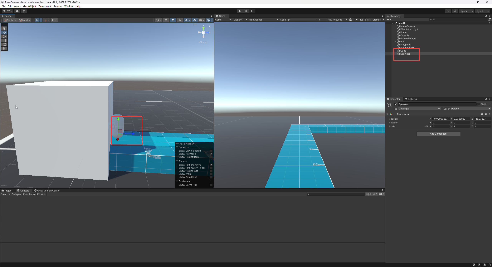

# RTS Tower Defence Game


Ontwerp document van de game


### Project creatie

Open Unity en druk op new project rechts-boven, selecteer de 3D Built in render pipeline en geef je projetc een naam (B.v. : TowerDefense)


### Beginnen aan de game!

Links onderen zie je de Scene SampleScene, verander de naam naar Level1

<figure><figcaption><p>Naam veranderen naar Level1</p></figcaption></figure>


Druk daarna van boven op Window -> Package Manager, Selecteer Unity Registry packages -> Typ AI Nav -> Selecteer en installeer de Ai navigation Package

<figure><figcaption><p>AI NavMesh Installeren</p></figcaption></figure>

Ga naar [deze link](https://assetstore.unity.com/packages/2d/textures-materials/gridbox-prototype-materials-129127) om the gridbox materials te downloaden voor unity dit gaan we gebruiken om de objecten tectures te geven zodat het niet allemaal wit is. Druk op openen in Unity en dan in Unity op download -> Import -> Import

Save je project en sluit het af start het daarna weer op. Dit is om de project te updaten met de nieuwe import van de AI navmesh package.


Spawn nu de 3D object Plane in de level door in je Hierarchy Rechtermuis te klikken -> 3D object -> Plane. Spawn ook een Cube en een Capsule in


<figure><figcaption><p>Objecten in spawnen</p></figcaption></figure>

Na het in spawnen van de objecten moet je de transform resetten. Dat doe je door het object te selecteren/klikken -> 3 stippen bij transform in de inspector -> Reset


<figure><figcaption><p>Transform Resetten</p></figcaption></figure>

Door op reset te drukken gaan de objecten naar de world origin(0/midden punt)

in dezelfde foto zie je de locatie van de materialen. Om die op je objecten te gebruiken moet je de gewenste material slepen naar het gewenste object.


Maak de Plane groter door bij transform -> Scale en zet alle drie de axis(X,Y,Z) op 5

Voor de Cube doe de Scale 2, 1, 2.


Plaats de ingespawnde objecten in ongeveer zo een layout in de level.

Maak daarna een empty object door weer rechter muis klik en dan 'Create Empty' boven 3d object, Noem de Empty "GameManager"


<figure><figcaption><p>Layout en GameManager</p></figcaption></figure>

Sellecteer GameManager dan in de inspector add component -> typ NavMeshSurface -> Klik erop

<figure><figcaption><p>NavMeshSurface</p></figcaption></figure>

Druk op de cube -> in de inspector Layer -> Add Layer -> Layer 6 -> Typ Walkable Terrain

<figure><figcaption><p>Layers</p></figcaption></figure>

Druk nog een keer op de cube en dan in de inspector op layers en selecteer de layer die je net hebt toegevoegd.

Sellecteer de GameManager en Onder Object Collection -> Include layers -> alleen de layer sellecteren die we net hebben gemaakt (Walkable Terrain)

Nadat je dit heb gedaan sleep je de cube van je hieracrcy naar je assets

<figure><figcaption><p>Prefab Maken</p></figcaption></figure>

Maak nu een simpele layout door de cube te sellecteren CTRL + D om dezelfde object op de locatie te plakken en dan CTRL ingedrukt tijdens het slepen met het pijltje om zo een simpele layout te maken.

Nadat je de layout heb gemaakt druk je op GameManager en Dan op Bake.

<figure><figcaption><p>NavMesh Setup</p></figcaption></figure>

Plaats de Capsule(Enemy) Op het blouwe vlakje wat is onstaan na het baken. Maak te Capsule ook wat kleiner door in de transform -> Scale 0.5, 0.5, 0.5


Druk op de 1ste plek waar er een bocht is en dan maak je een Empty, Geef die de naam Waypoint

<figure><figcaption><p>Waypoint</p></figcaption></figure>


Maak in de assets tab een nieuwe folder met de naam Scripts

<figure><figcaption><p>Scripts folder</p></figcaption></figure>


Maak in de Scripts folder een nieuwe C# Script en geef het de naam "EnemyController"

Sleep de script op je Capsule in de hierarchy

<figure><figcaption><p>Script op de enemy zetten</p></figcaption></figure>


Open de EnemyController script en plak dit erin

```csharp
using System.Collections;
using System.Collections.Generic;
using UnityEngine;
using UnityEngine.AI;

public class EnemyController : MonoBehaviour
{

    public List<Transform> WayPoints;
    private int currentWayPointIndex = 0;
    private float agentStoppingDistance = 0.3f;
    
    NavMeshAgent agent;

    // Start is called before the first frame update
    void Start()
    {
        if (WayPoints.Count == 0)
        {
            Debug.Log("There are no waypoints");
            return;
        }

        agent = GetComponent<NavMeshAgent>();
        agent.SetDestination(WayPoints[currentWayPointIndex].position);
    }

    // Update is called once per frame
    void Update()
    {
        if (!agent.pathPending && agent.remainingDistance <= agentStoppingDistance)
        {
            if (currentWayPointIndex == WayPoints.Count - 1)
            {
                Destroy(this.gameObject, 0.1f);
            }
            else
            {
                currentWayPointIndex++;
                agent.SetDestination(WayPoints[currentWayPointIndex].position);
            }
        }
    }
}

```

Druk op CTRL + S en ga terug naar unity

Druk op de Capsule scroll naar je script -> Druk het plusje en sleep de Waypoint of Waypoints object(en) van je hierarchy naar de waypoint in je script

<figure><figcaption><p>Waypoints</p></figcaption></figure>

